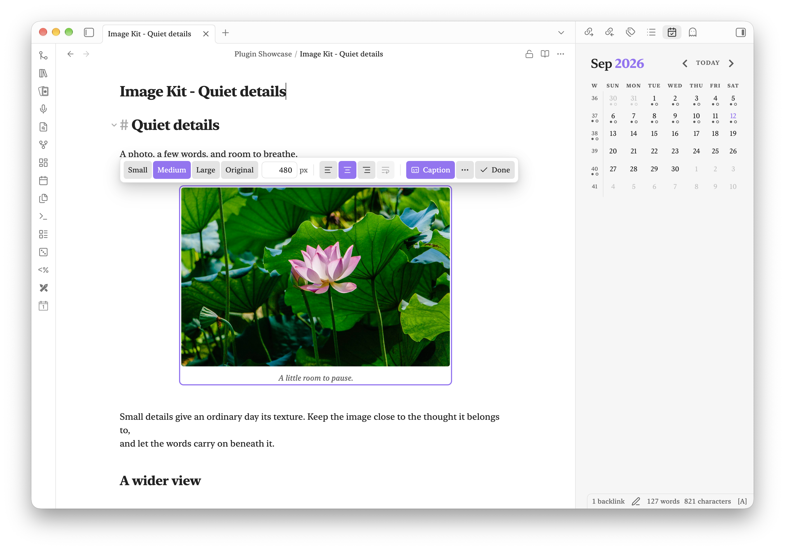
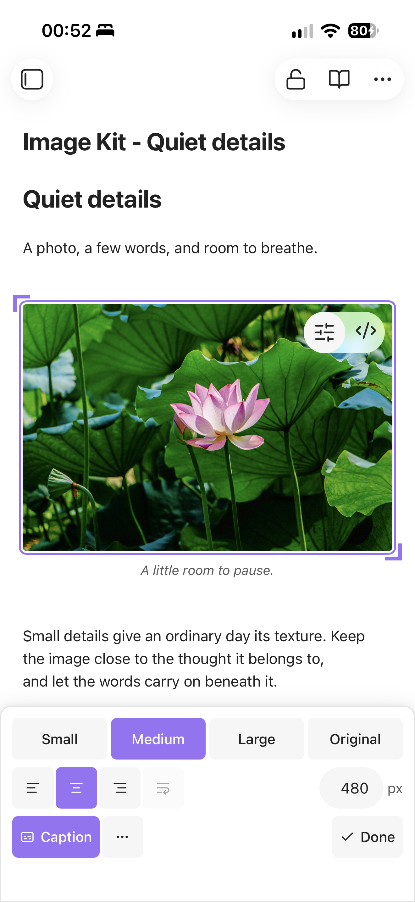
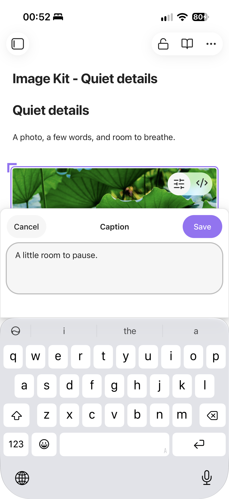
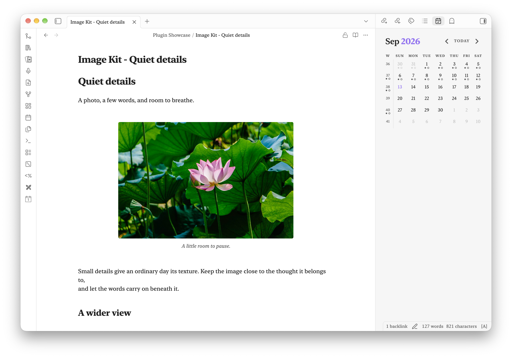
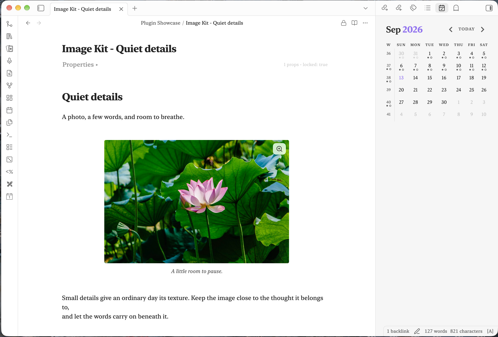

# Image Kit

Your everyday image workflow, in one place: choose a size, place the image, add a caption,
and get back to writing. Image Kit puts these controls beside Obsidian’s native image actions
on desktop and mobile.

<p align="center">
  
</p>

## What you can do

- Apply Small, Medium, Large, Original, or an exact width.
- On mobile, drag either diagonal corner grip to preview a new size; tap Done or outside the image to save.
- Align left, center, or right, and wrap text around an image.
- Add and edit a plain-text caption without editing the link syntax.
- Reveal the attachment in the file explorer, copy it, or open it fullscreen.
- Reset size and alignment while keeping the caption.
- Remove an image from the note while keeping its attachment.

In Live Preview, **Edit image** appears before Obsidian’s **Edit this block** button.
The native zoom and resize controls remain available. The desktop toolbar stays aligned
to the note column; phones get a compact bottom panel and a slide-up caption editor with Save and Cancel above the text field.
With **Page Lock**, locked images stay available to view while image editing is blocked.

<a href="https://www.buymeacoffee.com/robertfleming"></a>

## Made for touch, too

Resize with the corner grips, choose an alignment, and tap Done. Captions open in a
bottom sheet with Save and Cancel above the keyboard.

<p align="center">
  
  
</p>

## The complete image workflow

Use Image Kit on its own for individual image layout, or add its companions:

| Plugin | What it adds |
| --- | --- |
| **Image Kit** | Size, placement, captions, and attachment shortcuts |
| **[Fullscreen Image](https://github.com/haivri/obsidian-fullscreen-image)** | Fullscreen viewing with zoom buttons, pan, and gallery navigation |
| **[Simple Gallery](https://github.com/haivri/obsidian-simple-gallery)** | Photo galleries inside notes, with sections and captions |

Each plugin works independently. Image Kit delegates fullscreen viewing to Fullscreen Image
when enabled, or to Obsidian otherwise. Simple Gallery owns gallery editing.

## Start using it

1. In Live Preview, click **Edit image** to open the layout menu. On mobile, tap it.
2. Choose a size and alignment. Use **Caption** to add or change the caption.
3. Select **Done** and continue writing.

**Open image controls** in settings defaults to **Click only**. Choose **Hover or click** for desktop mouse access: hovering over **Edit image** opens a preview, which closes 300 ms after leaving both the button and menu. Move into either to keep it open. Clicking the button or interacting with a control keeps the menu open until Done, Escape, or an outside click. Mobile remains tap-only.

**More actions** includes file shortcuts, fullscreen viewing, Reset, and Remove image from note.
Reading view keeps captions and alignment visible, with image editing controls hidden.

<details>
<summary>See the finished layout and Page Lock integration</summary>

<p align="center">
  
  
</p>

</details>

## Your notes stay yours

Layout is saved in the image link:

```markdown
![[photo.jpg|A little room to pause.|center|480]]
```

There is no separate layout database. Obsidian can still apply the width if Image Kit is
removed; visible captions and alignment need a compatible plugin or renderer.
The optional paste/drop handler keeps the original image bytes and is off by default,
so your existing attachment workflow can continue.

Image Kit makes no telemetry requests. Remote image links follow Obsidian’s normal behavior.
It does not convert, compress, crop, rotate, or annotate images.

## Installation

Requires **Obsidian 1.13 or newer**, on desktop or mobile.

Download `main.js`, `manifest.json`, and `styles.css` from the
[latest release](https://github.com/haivri/obsidian-image-kit/releases/latest). Place them in
`<vault>/.obsidian/plugins/image-kit/`, reload Obsidian, and enable **Image Kit** in
**Settings → Community plugins**. Keep your existing `data.json` when updating.

For mobile, you can also add `haivri/obsidian-image-kit` through
[BRAT](https://github.com/TfTHacker/obsidian42-brat). Image Kit is not yet listed in
Obsidian’s Community plugins directory.

Captions are plain text. Avoid numeric-only captions and standalone layout keywords such as
`center`, which the image-link syntax interprets as size or alignment. Local attachments are
the primary supported workflow; external images in Reading view and popout windows have
limited support.

## Screenshots and development

The [showcase bootstrap](bootstrap/README.md) provides the demo note and
[photo credits](bootstrap/vault/Plugin%20Showcase/Image%20Kit%20-%20Photo%20credits.md).
See [CONTRIBUTING.md](CONTRIBUTING.md) for testing.

```sh
npm ci
npm test
npm run lint
npm run build
npm run publish:vault
```

## Support

If Image Kit improves your workflow, you can support development on
[Buy Me a Coffee](https://www.buymeacoffee.com/robertfleming).

## License

MIT. Demo photographs retain their own license and attribution.
